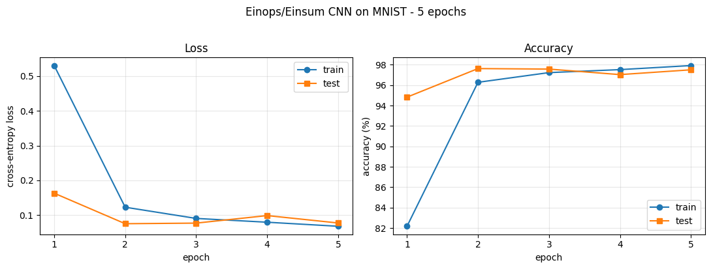
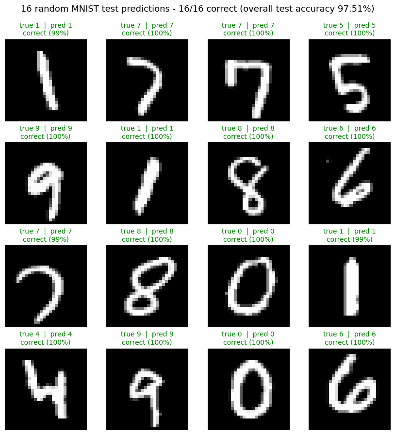

# ME1: A 3-Layer CNN for MNIST Built from `einops` and `torch.einsum`

**Course:** AI 231 · **Author:** Lacuata

This exercise builds a convolutional network for MNIST digit classification in which every
layer is hand-implemented with `einops` (`rearrange`, `reduce`) and `torch.einsum`. Nothing
in the forward path calls `nn.Conv2d`, `nn.Linear`, `nn.MaxPool2d`, `nn.BatchNorm2d`,
`F.conv2d`, `F.max_pool2d`, `F.linear`, or `F.unfold`. The whole network is assembled from
index notation, then trained and evaluated the way any other model would be.

> ### Final test accuracy: **97.51%** (9,751 / 10,000)
> 5 epochs on CPU · 6,218 trainable parameters · 432 s training time

---

## Files

| File | What it is |
|---|---|
| `me1_einops_cnn.ipynb` | **The deliverable.** Executed end to end with outputs intact, covering the layer derivations, the model definition, correctness verification, the learning-rate sweep, 5 epochs of training, final test accuracy, the per-class breakdown, and the 4×4 prediction grid. |
| `einops_cnn.py` | The same layers and model packaged as an importable module, so they can be reused and tested outside the notebook. |
| `test_correctness.py` | Checks the einsum layers against `F.conv2d` and `F.max_pool2d`, which serve as a reference oracle. |
| `figures/` | The plots produced by the notebook, saved out so this README can show them. |
| `requirements.txt` | The versions this was developed and run against, pinned. |

---

## What the model uses, and what it avoids

The brief rules out the built-in layers, so the table below draws the line precisely and
explains why the surviving imports belong on the permitted side of it.

| Absent from the forward math | Present, and consistent with the brief |
|---|---|
| `nn.Conv2d`, `nn.Linear`, `nn.MaxPool2d`, `nn.BatchNorm2d` | `nn.Parameter`, a weight *container* rather than a layer |
| `F.conv2d`, `F.max_pool2d`, `F.linear`, `F.unfold` | `nn.Module`, a parameter *registry* that lets `torch.optim` find the weights |
| any built-in convolution routine | `torch.optim` and autograd, which handle optimisation rather than layer implementation |
| | `F.relu` and `F.cross_entropy`, the activation and loss, both explicitly permitted |

`F.conv2d` and `F.max_pool2d` do appear in the repository, though only inside verification
code (notebook §2.1 and `test_correctness.py`), where they act as a reference oracle proving
that the einsum implementation computes an identical function. They never touch the model.

---

## How each layer is implemented

### Convolution, expressed as one `einsum`

A convolution output is defined by

```
y[b,o,h,w] = Σ_i Σ_p Σ_q  x[b, i, h+p, w+q] · W[o,i,p,q]  +  β[o]
```

which is a sum of products over three indices `(i, p, q)`, precisely the shape of
computation that `einsum` exists to express. The one obstacle is that `x` is read at the
shifted positions `h+p, w+q`, and `einsum` has no way to offset an index by itself.
Materialising the sliding window ahead of time clears that obstacle, which is what
`extract_patches` does through the classic **im2col** trick, producing
`patches[b,i,h,w,p,q] = x[b,i,h+p,w+q]`. From there the entire convolution collapses into a
single line.

```python
torch.einsum('bihwpq,oipq->bohw', patches, weight)
```

Because `i`, `p`, and `q` never appear to the right of the arrow, einsum sums over them,
folding away the input channel and both kernel axes while `b`, `o`, `h`, and `w` survive
into the output.

Patch extraction leans on `Tensor.unfold`, a pure stride and view operation that reindexes
memory already allocated and performs no arithmetic of its own, so no built-in convolution
slips in through the back door. Zero-padding is likewise done by hand, by allocating a
larger buffer of zeros and copying the image into the middle of it.

### Pooling, stated directly with `einops.reduce`

Pooling needs no einsum at all, since `reduce` says the thing outright.

```python
reduce(x, 'b c (h ph) (w pw) -> b c h w', 'max', ph=2, pw=2)   # 2x2 max-pool
reduce(x, 'b c h w -> b c', 'mean')                            # global average pool
```

Each pattern factorises a spatial axis into a block index and a position within that block,
then reduces the within-block axes away. That factorisation is the definition of pooling,
written declaratively instead of invoked as a module.

### The fully-connected head, a contraction over features

```python
torch.einsum('bf,fo->bo', x, weight) + bias
```

---

## Architecture

```
input                                  (b,  1, 28, 28)
conv1   1 -> 8    3x3 s1 p1  + ReLU    (b,  8, 28, 28)
maxpool 2x2                            (b,  8, 14, 14)
conv2   8 -> 16   3x3 s1 p1  + ReLU    (b, 16, 14, 14)
maxpool 2x2                            (b, 16,  7,  7)
conv3  16 -> 32   3x3 s1 p1  + ReLU    (b, 32,  7,  7)
global average pool                    (b, 32)
linear head 32 -> 10                   (b, 10)   <- raw logits
```

That comes to **6,218 trainable parameters**, split as conv1 80, conv2 1,168, conv3 4,640,
and head 330. Each choice behind the diagram is worth spelling out.

- **3×3 kernels, stride 1, padding 1.** Padding of 1 keeps every convolution
  shape-preserving, which confines all downsampling to the pooling layers and keeps the
  shape trace trivial to follow. A 3×3 window is the smallest that can still represent
  orientation and edges, and stacking three of them yields a 7×7 effective receptive field
  that covers essentially the whole digit once the two pools have run.
- **Channel widths 8 → 16 → 32.** This follows the standard schedule of halving the
  resolution while doubling the channels, since each 2×2 pool discards four times the
  spatial information and the extra channels keep the representation from collapsing.
  Starting at 8 holds the model near 6k parameters, which matters a great deal when
  training happens on CPU.
- **Pooling after conv1 and conv2, but not conv3.** Two pools take 28 → 14 → 7, and a third
  would leave a 3×3 map that global average pooling makes redundant anyway.
- **Global average pooling in place of flattening.** Flattening 32×7×7 = 1,568 features
  would demand a **15,690**-parameter head, roughly 70% of the entire model and the first
  thing that would overfit. Global average pooling brings that down to **330** parameters
  and pushes conv3's 32 channels to become class-relevant features in their own right. Of
  every decision here, this one shapes the model most.
- **Logits rather than probabilities on the output.** `F.cross_entropy` applies log-softmax
  internally, so adding a softmax of our own would be numerically worse and mathematically
  wrong.

Initialisation follows the activation that comes after each layer. The convolutions use
He/Kaiming-normal (`std = sqrt(2/fan_in)`), where the factor of 2 compensates for the ReLU
zeroing half the activations. The head uses Xavier/Glorot-uniform instead, because it feeds
a softmax rather than a ReLU and therefore wants unit gain.

---

## Hyperparameters

| Hyperparameter | Value | Justification |
|---|---|---|
| Batch size | **128** | Benchmarked on the actual machine, where 64 gave 1,908 img/s, **128 gave 2,231 img/s**, and 256 fell to 1,076 img/s. 128 is the throughput optimum, since larger batches push the im2col patch tensor out of cache. |
| Optimizer | **Adam** | Per-parameter adaptive step sizes remove the need for a hand-tuned LR schedule inside a fixed 5-epoch budget. |
| Learning rate | **1e-2** | Selected by a sweep over {1e-3, 3e-3, 1e-2} on a held-out 5k validation split, scoring 88.84%, 93.14%, and **95.58%** after one epoch. **This is the least rigorous choice in the project, and the caveat below explains why.** |
| Weight decay | **0** | Roughly 6k parameters against 60k images leaves the model capacity-limited rather than prone to overfitting, so regularisation would only slow fitting. The +0.41% train/test gap confirms it. |
| Epochs | **5** | Fixed by the exercise specification. |
| Loss | **Cross-entropy** | Standard for single-label multi-class classification, and it consumes raw logits. |
| Normalisation | **mean 0.1307, std 0.3081** | MNIST's conventional dataset-wide statistics. Zero-centred unit-variance inputs are exactly what the He initialisation assumes, so the two choices go together. |
| Augmentation | **none** | The model is capacity-limited rather than data-limited, so augmentation would slow convergence inside 5 epochs while addressing an overfitting problem that does not exist here. |
| Seed | **0** | Set once at the top of the notebook. |

No decision anywhere in the project consults the test split. Learning-rate selection runs on
a validation split held out of the training data, and test accuracy is printed each epoch
purely for visibility before being reported as the final number.

### ⚠️ Caveat: the learning-rate sweep is the weakest part of this project

Stating this openly seems better than papering over it, since it is the first thing a
careful reader should question. Two problems compound each other.

1. **The winner sits on the edge of the grid.** The sweep chose `1e-2`, the largest value
   tried, and when the best value lands on an endpoint the honest reading is that the grid
   was drawn too narrowly, leaving the true optimum possibly outside it. A sound sweep keeps
   widening until the winner sits *interior* to the range.
2. **A 1-epoch proxy structurally favours large learning rates.** A large step size makes
   rapid early progress, which is exactly what a one-epoch score rewards, while carrying a
   higher risk of instability later on. Selecting under a budget that differs from the one
   actually deployed means selecting for the wrong thing.

The results show the consequence directly. Test accuracy peaks at **97.63% in epoch 2**,
then oscillates down to **97.51%** by epoch 5 instead of converging cleanly, which is the
signature of a step size slightly too large for the later part of training.

The fix would be to widen the grid (adding `3e-2`, for instance), give each candidate the
full 5-epoch budget, select on final-epoch validation accuracy, and confirm the winner sits
away from the boundary. Compute budget alone kept it out of this run, at roughly 30 minutes
against the 1 minute the shortcut cost.

The result still stands on its own terms. The objective of the exercise is the einsum and
einops implementation, and 97.51% is a genuine held-out number produced by a fully
specified, seeded, reproducible procedure. The learning rate is best described as reasonable
and evidence-informed rather than tuned, and tightening it would likely buy back a few
tenths of a percent.

---

## Results

| Metric | Value |
|---|---|
| **Final test accuracy** | **97.51%** (9,751 / 10,000) |
| Final test loss | 0.0772 |
| Train accuracy (epoch 5) | 97.92% |
| Generalisation gap | +0.41% |
| Trainable parameters | 6,218 |
| Training time (5 epochs, 6 CPU threads) | 432.3 s |

Epoch by epoch, the run went as follows.

| Epoch | Train loss | Train acc | Test loss | Test acc | Time |
|---:|---:|---:|---:|---:|---:|
| 1 | 0.5306 | 82.17% | 0.1630 | 94.83% | 65.0 s |
| 2 | 0.1227 | 96.28% | 0.0752 | **97.63%** | 81.3 s |
| 3 | 0.0904 | 97.23% | 0.0769 | 97.58% | 91.6 s |
| 4 | 0.0794 | 97.53% | 0.0986 | 97.04% | 93.9 s |
| 5 | 0.0678 | 97.92% | 0.0772 | 97.51% | 100.6 s |



The curves tell that same story visually, with loss on the left, accuracy on the right, and
train plotted against test in both. Almost all of the learning happens by epoch 2, after
which the pairs of curves flatten and stay close together, which is the picture of a
capacity-limited model rather than an overfitting one. The shallow dip in test accuracy at
epoch 4 is the oscillation described in the caveat above.

Broken down by digit, the weakest class is **3 at 93.17%** and the strongest is **4 at
99.59%**.

| digit | 0 | 1 | 2 | 3 | 4 | 5 | 6 | 7 | 8 | 9 |
|---|---|---|---|---|---|---|---|---|---|---|
| acc | 96.43% | 99.03% | 99.03% | **93.17%** | 99.59% | 98.99% | 97.91% | 96.50% | 97.23% | 97.22% |



A seeded random draw of sixteen test images gives a qualitative check to set beside the
aggregate numbers, each panel showing the true label, the prediction, and the model's
confidence. All sixteen come out correct with confidences clustered at 99% and above, which
is roughly what a 97.51% classifier should produce on a sample this small.

The layers themselves were verified against torch's reference implementations before any of
this training took place.

```
einsum conv (k=3,s=1,p=1) vs F.conv2d      max abs err = 7.15e-07
einsum conv (k=5,s=2,p=2) vs F.conv2d      max abs err = 1.19e-06
einops maxpool            vs F.max_pool2d  max abs err = 0.00e+00
einops global avgpool     vs x.mean(2,3)   max abs err = 0.00e+00

gradients reached all 8 parameter tensors, all finite
```

Agreement at float32 precision establishes that the einsum implementation computes the same
function as the library routine. Saying that `nn.Conv2d` never appears here therefore
describes how the model was built, while the correctness of its results rests on firm
ground.

---

## Reproducing

```bash
pip install -r requirements.txt

# Verify the einsum layers match torch's reference implementations:
python test_correctness.py

# Run the full exercise (downloads MNIST on first run, ~9 min on CPU):
jupyter nbconvert --to notebook --execute --inplace me1_einops_cnn.ipynb
# ...or just open me1_einops_cnn.ipynb and Run All.
```

Everything is seeded through `SEED = 0`, so a re-run reproduces the numbers above.
`torchvision` downloads MNIST automatically into `data/` on first run, and that directory is
gitignored rather than committed.

---

## Discussion

**What the exercise demonstrates.** Convolution, pooling, and matrix multiplication all turn
out to be one operation wearing three different costumes, a contraction over chosen axes.
Writing them with `einsum` and `einops.reduce` makes that shared structure explicit, since
each becomes a single line naming which axes get summed and which survive. The `torch.nn`
layers are performance wrappers built around the same idea.

**The cost of doing it longhand.** `extract_patches` materialises a `(b, c, h, w, k, k)`
tensor, nine times the size of the input feature map for a 3×3 kernel. `nn.Conv2d` sidesteps
that blow-up by dispatching to fused kernels that never build the patch tensor explicitly,
so memory traffic is the real price of the explicit version. It also explains why the
batch-size benchmark falls off a cliff at 256, the point where the patch tensor stops
fitting in cache.

**Where the remaining error lives.** With a 32-dimensional globally-pooled representation
feeding a 330-parameter head, the model has little capacity left for separating visually
similar digits. Digit 3 stands out at 93.17% while every other class clears 96%, though
naming the digits it gets confused with would require a confusion matrix that this notebook
does not compute. Widening the channels or replacing global average pooling with a small
hidden layer is the most promising next step, whereas training longer would achieve little,
since the learning curves are flat by epoch 5 and the model is capacity-limited rather than
underfit.
